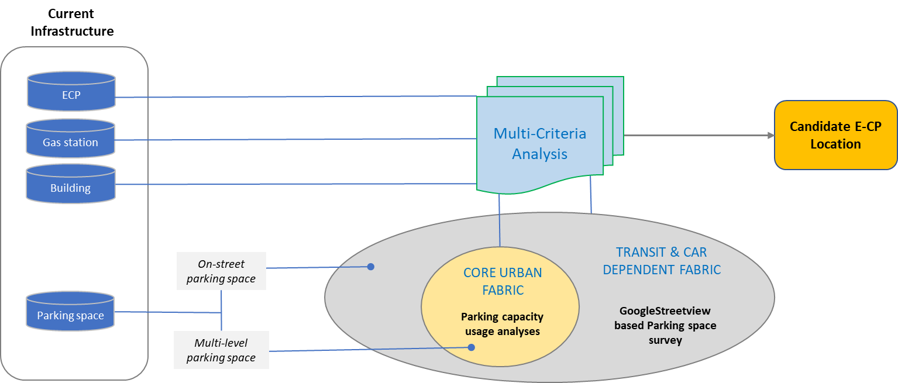
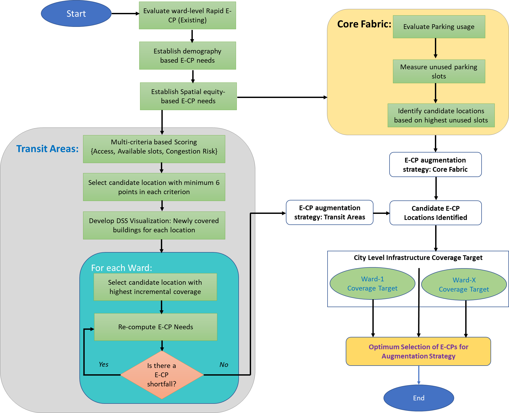

```{r setup, include=FALSE}
knitr::opts_chunk$set(message=FALSE,warning=FALSE, cache=TRUE)
```


#Data

<div class="col-sm-12">

<a href = "https://ssujit.github.io/dd_ecp_park_dss">



</a>
</div>

<p></p>

#Method

<div class="col-sm-12">
<a href = "https://ssujit.github.io/dd_ecp_park_dss">


</a>
</div>
